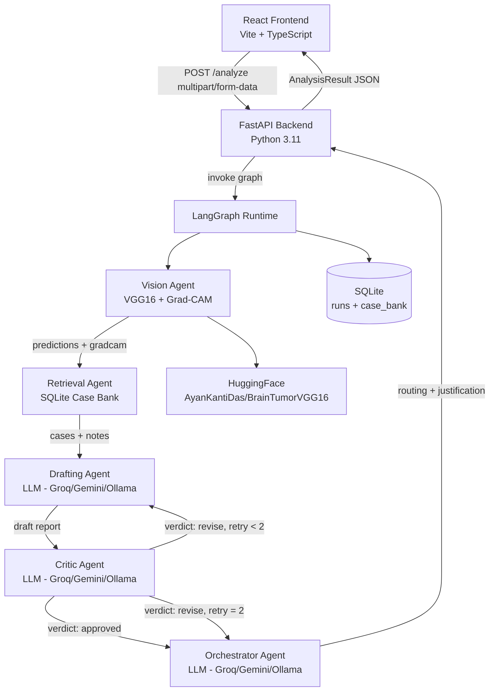
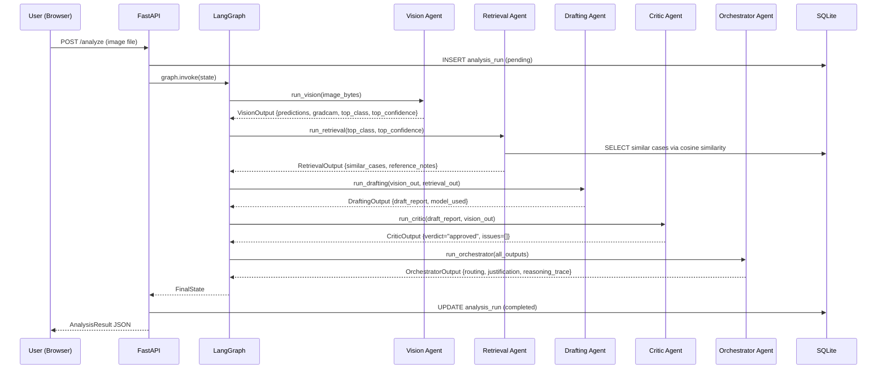
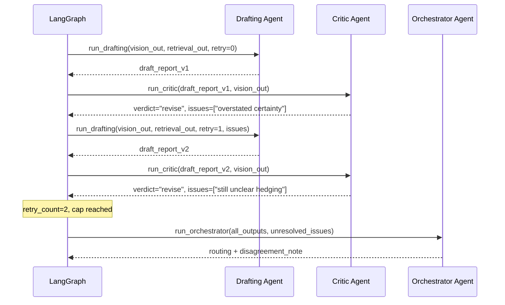

# Design Document: NeuroTriage — Multi-Agent Brain MRI Analysis Assistant

## Overview

NeuroTriage is a full-stack web application that analyzes brain MRI scans using a coordinated team
of five specialized AI agents orchestrated via LangGraph. Unlike a simple linear pipeline, the system
implements a verification-first architecture where a dedicated Critic Agent can reject the Drafting
Agent's output and send it back for revision — making quality assurance a first-class control-flow
decision rather than a post-hoc logging step.

The system classifies MRI scans into four categories (glioma, meningioma, no tumor, pituitary tumor)
using a pretrained VGG16-based CNN, augments the classification with retrieved historical cases and
Grad-CAM visual explanations, produces a plain-language clinical report, and routes the case to an
urgency tier with a traceable reasoning chain. The frontend provides a live agent-trace panel so
users can observe each agent's contribution as the pipeline executes.

## Architecture



## Sequence Diagrams

### Main Analysis Flow — Happy Path (Critic Approves First Pass)



### Critic Revision Loop — Ambiguous Scan




## Components and Interfaces

### Component 1: Vision Agent

**Purpose**: Load the pretrained VGG16 classifier, run inference with raw 0-255 pixel values (no
normalization), extract per-class probabilities, and generate a Grad-CAM heatmap over the
`dropout_4` layer.

**Interface**:
```python
class VisionOutput(TypedDict):
    predictions: dict[str, float]   # {"glioma": 0.50, "meningioma": 0.23, ...}
    top_class: str
    top_confidence: float
    gradcam_image: str              # base64-encoded PNG overlay
    feature_embedding: list[float]  # 512-dim vector from dropout_5

def run_vision_agent(state: GraphState) -> GraphState:
    """Populates state["vision_output"]. Raises VisionError on model load failure."""
```

**Responsibilities**:
- Load model from HuggingFace cache (`AyanKantiDas/BrainTumorVGG16`)
- Resize input to 150×150×3 and cast to float32 WITHOUT dividing by 255
- Run `model.predict()` and map indices → class names (0=glioma, 1=meningioma, 2=notumor, 3=pituitary)
- Compute Grad-CAM using `tf.GradientTape` targeting `dropout_4`
- Extract 512-dim embedding from `dropout_5` for retrieval similarity
- Return `VisionOutput` including base64 heatmap image

---

### Component 2: Retrieval Agent

**Purpose**: Find the top-3 most similar historical cases from the SQLite case bank using cosine
similarity on 512-dim feature embeddings, and attach general reference notes for the predicted class.

**Interface**:
```python
class SimilarCase(TypedDict):
    case_id: str
    tumor_type: str
    confidence: float
    summary: str
    similarity_score: float

class RetrievalOutput(TypedDict):
    similar_cases: list[SimilarCase]
    reference_notes: list[str]

def run_retrieval_agent(state: GraphState) -> GraphState:
    """Populates state["retrieval_output"]. Returns empty lists if case bank unavailable."""
```

**Responsibilities**:
- Query SQLite `case_bank` table for rows matching the top class
- Compute cosine similarity between query embedding and stored `feature_vector` (512-dim)
- Return top-3 results sorted by similarity descending
- Fetch reference notes from `reference_notes` table for the top class

---

### Component 3: Drafting Agent

**Purpose**: Use an LLM (with Groq → Gemini → Ollama fallback chain) to write a structured,
plain-language report from Vision and Retrieval outputs. On a revision pass, it receives the
Critic's issues list and must address each explicitly.

**Interface**:
```python
class DraftingOutput(TypedDict):
    draft_report: str
    model_used: str          # "groq/llama-3.3-70b-versatile", "gemini-2.5-flash", "ollama/mistral"
    revision_number: int

def run_drafting_agent(state: GraphState) -> GraphState:
    """Populates state["drafting_output"]. Implements LLM fallback chain."""
```

**Responsibilities**:
- On first pass: synthesize Vision + Retrieval data into a structured report with sections:
  Classification, Confidence, Visual Evidence, Similar Cases, Clinical Notes, Caveats
- On revision pass: re-draft the report, explicitly addressing each issue from `critic_issues`
- Hedge appropriately when `top_confidence < 0.6`
- Implement LLM fallback: try Groq → on 429/quota → try Gemini → on error → use Ollama
- Record which model was ultimately used in `model_used`

---

### Component 4: Critic Agent

**Purpose**: Act as an independent LLM reviewer that cross-checks the draft report against the
raw Vision output (NOT the retrieval context). It flags overstated certainty, missed findings,
and unsupported claims.

**Interface**:
```python
class CriticOutput(TypedDict):
    verdict: Literal["approved", "revise"]
    issues: list[str]        # empty when approved
    model_used: str

def run_critic_agent(state: GraphState) -> GraphState:
    """Populates state["critic_output"]. Never raises — worst case returns verdict='approved'."""
```

**Responsibilities**:
- Receive: draft report + raw VisionOutput (deliberately NOT retrieval context)
- Evaluate: does the report's stated confidence match `top_confidence`? Are non-top classes ignored?
  Are Grad-CAM regions described accurately?
- Return `verdict="revise"` with specific issue strings when any check fails
- Return `verdict="approved"` when the draft faithfully represents model evidence
- Use same LLM fallback chain as Drafting Agent

---

### Component 5: Orchestrator Agent

**Purpose**: Make the final routing decision (auto-clear / needs-review / urgent) with a written
justification that references specific evidence from all agents. Always receives the complete agent
trace, including unresolved Critic issues when the retry cap was hit.

**Interface**:
```python
class OrchestratorOutput(TypedDict):
    routing: Literal["auto-clear", "needs-review", "urgent"]
    justification: str
    reasoning_trace: list[dict]   # [{agent, summary, key_evidence}, ...]
    model_used: str

def run_orchestrator_agent(state: GraphState) -> GraphState:
    """Populates state["orchestrator_output"]. Final node — always runs."""
```

**Responsibilities**:
- Receive all upstream agent outputs + unresolved issues (if retry cap hit)
- Route to "urgent" if top_confidence > 0.75 for glioma or pituitary
- Route to "needs-review" if confidence 0.4–0.75 or if unresolved Critic issues exist
- Route to "auto-clear" only if `top_class == "notumor"` and `top_confidence > 0.80`
- Write a reasoning_trace entry per agent summarizing its contribution
- Use same LLM fallback chain

---

### Component 6: LangGraph Graph Definition

**Purpose**: Wire all agents into a stateful graph with a conditional edge implementing the
Critic revision loop.

**Interface**:
```python
class GraphState(TypedDict):
    image_bytes: bytes
    vision_output: VisionOutput | None
    retrieval_output: RetrievalOutput | None
    drafting_output: DraftingOutput | None
    critic_output: CriticOutput | None
    orchestrator_output: OrchestratorOutput | None
    critic_retry_count: int
    critic_issues_history: list[list[str]]

def build_graph() -> CompiledGraph:
    """Returns compiled LangGraph graph ready for .invoke()"""

def critic_router(state: GraphState) -> str:
    """Conditional edge: returns 'drafting' (retry) or 'orchestrator' (proceed)."""
```

**Responsibilities**:
- Define all five agent nodes
- Add sequential edges: vision → retrieval → drafting → critic
- Add conditional edge after critic: if `verdict=="revise"` AND `retry_count < 2` → drafting;
  else → orchestrator
- Increment `critic_retry_count` on each revision cycle
- Accumulate `critic_issues_history` for Orchestrator context

---

### Component 7: FastAPI Backend

**Purpose**: HTTP layer that accepts uploads, runs the LangGraph graph, persists results to SQLite,
and serves the AnalysisResult to the frontend.

**Interface**:
```python
@app.post("/analyze", response_model=AnalysisResult)
async def analyze_mri(file: UploadFile = File(...)) -> AnalysisResult:
    """Accepts JPEG/PNG, returns full analysis result."""

@app.get("/history", response_model=list[AnalysisSummary])
async def get_history() -> list[AnalysisSummary]:
    """Returns list of past analysis runs from SQLite."""

@app.get("/gradcam/{run_id}", response_model=GradCAMResponse)
async def get_gradcam(run_id: str) -> GradCAMResponse:
    """Returns base64 Grad-CAM image for a stored run."""
```

---

### Component 8: React Frontend

**Purpose**: Single-page app providing drag-and-drop MRI upload, animated agent trace panel
showing live progress, report display, and Grad-CAM heatmap overlay.

**Key Components**:
```typescript
interface AnalysisResult {
  run_id: string
  top_class: string
  top_confidence: number
  predictions: Record<string, number>
  gradcam_image: string        // base64 PNG
  draft_report: string
  routing: "auto-clear" | "needs-review" | "urgent"
  justification: string
  reasoning_trace: AgentTraceEntry[]
  models_used: Record<string, string>
  critic_revision_count: number
  created_at: string
}

interface AgentTraceEntry {
  agent: string
  summary: string
  key_evidence: string
  status: "pending" | "running" | "done" | "error"
}
```


## Data Models

### Model 1: AnalysisRun (SQLite)

```python
class AnalysisRun(Base):
    __tablename__ = "analysis_runs"
    id: str               # UUID primary key
    created_at: datetime
    status: str           # "pending" | "completed" | "failed"
    original_filename: str
    top_class: str
    top_confidence: float
    predictions_json: str     # JSON blob of {class: prob}
    gradcam_image_b64: str    # base64 PNG
    feature_embedding: str    # JSON blob of float[512]
    draft_report: str
    routing: str              # "auto-clear" | "needs-review" | "urgent"
    justification: str
    reasoning_trace_json: str # JSON blob of AgentTraceEntry[]
    critic_revision_count: int
    models_used_json: str     # JSON blob of {agent: model_name}
    error_message: str | None
```

**Validation Rules**:
- `top_confidence` in range [0.0, 1.0]
- `routing` must be one of: "auto-clear", "needs-review", "urgent"
- `status` must be one of: "pending", "completed", "failed"

---

### Model 2: CaseBank Entry (SQLite)

```python
class CaseBankEntry(Base):
    __tablename__ = "case_bank"
    id: str                   # UUID primary key
    tumor_type: str           # "glioma" | "meningioma" | "notumor" | "pituitary"
    confidence_at_insertion: float
    summary: str              # Plain-language case description
    feature_vector: str       # JSON blob of float[512] from dropout_5
    source_file: str          # Original filename or dataset reference
    created_at: datetime
```

**Validation Rules**:
- `tumor_type` must be one of the four valid classes
- `feature_vector` must decode to exactly 512 floats

---

### Model 3: ReferenceNotes (SQLite)

```python
class ReferenceNote(Base):
    __tablename__ = "reference_notes"
    id: str
    tumor_type: str
    note_text: str
    source: str    # e.g., "WHO Classification of Tumours", "seeded"
```

---

### Model 4: GraphState (LangGraph runtime, in-memory)

```python
class GraphState(TypedDict):
    image_bytes: bytes
    vision_output: VisionOutput | None
    retrieval_output: RetrievalOutput | None
    drafting_output: DraftingOutput | None
    critic_output: CriticOutput | None
    orchestrator_output: OrchestratorOutput | None
    critic_retry_count: int              # starts at 0, max 2
    critic_issues_history: list[list[str]]
```


## Algorithmic Pseudocode

### Main Analysis Algorithm

```python
ALGORITHM analyze_mri(image_bytes: bytes) -> AnalysisResult

INPUT: image_bytes — raw bytes of uploaded JPEG/PNG MRI scan
OUTPUT: AnalysisResult — complete analysis with routing decision

BEGIN
  ASSERT len(image_bytes) > 0

  # Phase 1: Vision
  state = GraphState(image_bytes=image_bytes, critic_retry_count=0)
  state = vision_agent(state)
  ASSERT state.vision_output is not None
  ASSERT sum(state.vision_output.predictions.values()) ≈ 1.0

  # Phase 2: Retrieval
  state = retrieval_agent(state)

  # Phase 3: Draft → Critic loop
  WHILE state.critic_retry_count <= MAX_CRITIC_RETRIES DO
    INVARIANT: state.critic_retry_count >= 0
    INVARIANT: len(state.critic_issues_history) == state.critic_retry_count

    state = drafting_agent(state)
    state = critic_agent(state)

    IF state.critic_output.verdict == "approved" THEN
      BREAK
    END IF
    state.critic_retry_count += 1
    state.critic_issues_history.append(state.critic_output.issues)
  END WHILE

  # Phase 4: Orchestrate
  state = orchestrator_agent(state)

  ASSERT state.orchestrator_output.routing in {"auto-clear", "needs-review", "urgent"}
  RETURN build_result(state)
END
```

**Preconditions:**
- `image_bytes` is non-empty valid JPEG or PNG data
- Model weights accessible (local cache or HuggingFace download)
- At least one LLM provider reachable (Groq, Gemini, or Ollama)

**Postconditions:**
- `AnalysisResult.routing` is one of the three valid tiers
- `AnalysisResult.reasoning_trace` contains one entry per agent
- `AnalysisResult.critic_revision_count` <= 2

**Loop Invariants:**
- `critic_retry_count` is non-negative and non-decreasing
- `len(critic_issues_history) == critic_retry_count` at start of each iteration
- All previous draft reports are preserved in `critic_issues_history` for Orchestrator

---

### Vision Agent Algorithm

```python
ALGORITHM run_vision(image_bytes: bytes, model: keras.Model) -> VisionOutput

BEGIN
  # CRITICAL: DO NOT normalize — model expects raw 0-255 values
  img_array = decode_image(image_bytes)           # shape: (H, W, 3), dtype: uint8
  img_resized = resize(img_array, (150, 150))     # shape: (150, 150, 3)
  img_float = cast_to_float32(img_resized)        # range [0, 255], NOT [0, 1]
  img_batch = expand_dims(img_float, axis=0)      # shape: (1, 150, 150, 3)

  ASSERT img_batch.dtype == float32
  ASSERT img_batch.min() >= 0.0
  ASSERT img_batch.max() <= 255.0

  # Inference
  raw_probs = model.predict(img_batch)[0]         # shape: (4,)
  class_map = {0: "glioma", 1: "meningioma", 2: "notumor", 3: "pituitary"}
  predictions = {class_map[i]: float(raw_probs[i]) for i in range(4)}
  top_class = argmax(predictions)
  top_confidence = predictions[top_class]

  ASSERT abs(sum(predictions.values()) - 1.0) < 1e-4

  # Grad-CAM via GradientTape targeting dropout_4
  gradcam_layer = model.get_layer("dropout_4")
  grad_model = Model(inputs=model.inputs, outputs=[gradcam_layer.output, model.output])

  WITH tf.GradientTape() AS tape DO
    conv_outputs, class_probs = grad_model(img_batch)
    class_idx = list(class_map.values()).index(top_class)
    loss = class_probs[:, class_idx]
  END WITH

  grads = tape.gradient(loss, conv_outputs)         # shape: (1, H', W', C)
  pooled_grads = reduce_mean(grads, axes=[0, 1, 2]) # shape: (C,)
  heatmap = reduce_mean(conv_outputs[0] * pooled_grads, axis=-1)
  heatmap = relu(heatmap)
  heatmap = normalize_to_0_255(heatmap)
  gradcam_overlay = blend_heatmap_onto_original(heatmap, img_array)
  gradcam_b64 = base64_encode_png(gradcam_overlay)

  # Feature embedding from dropout_5
  embed_model = Model(inputs=model.inputs, outputs=model.get_layer("dropout_5").output)
  embedding = embed_model.predict(img_batch)[0]     # shape: (512,)
  ASSERT len(embedding) == 512

  RETURN VisionOutput(
    predictions=predictions,
    top_class=top_class,
    top_confidence=top_confidence,
    gradcam_image=gradcam_b64,
    feature_embedding=list(embedding)
  )
END
```

**Preconditions:**
- `image_bytes` is valid JPEG or PNG
- `model` has layers named `dropout_4` and `dropout_5`
- Input size is 150×150×3

**Postconditions:**
- `sum(predictions.values()) ≈ 1.0`
- `top_class` is one of the four valid class strings
- `len(feature_embedding) == 512`
- `gradcam_image` is a valid base64-encoded PNG string

---

### LLM Fallback Algorithm

```python
ALGORITHM call_llm_with_fallback(prompt: str, system_prompt: str) -> LLMResponse

BEGIN
  # Attempt 1: Groq
  TRY
    response = groq_client.chat(
      model=GROQ_MODEL,
      messages=[{role: "system", content: system_prompt},
                {role: "user", content: prompt}]
    )
    RETURN LLMResponse(text=response.content, model_used="groq/" + GROQ_MODEL)
  CATCH (RateLimitError, QuotaExceededError) AS e
    log_warning("Groq quota exceeded, falling back to Gemini")
  END TRY

  # Attempt 2: Gemini
  TRY
    response = gemini_client.generate_content(
      contents=[{parts: [{text: system_prompt + "\n\n" + prompt}]}]
    )
    RETURN LLMResponse(text=response.text, model_used="gemini/gemini-2.5-flash")
  CATCH Exception AS e
    log_warning("Gemini failed, falling back to Ollama")
  END TRY

  # Attempt 3: Ollama (local, always available)
  response = ollama_client.chat(
    model=OLLAMA_MODEL,
    messages=[{role: "system", content: system_prompt},
              {role: "user", content: prompt}]
  )
  RETURN LLMResponse(text=response["message"]["content"], model_used="ollama/" + OLLAMA_MODEL)
END
```

**Preconditions:**
- At least Ollama is running locally with `OLLAMA_MODEL` pulled
- `GROQ_API_KEY` and `GEMINI_API_KEY` present in environment (may be expired)

**Postconditions:**
- Always returns a response (Ollama is the unconditional final fallback)
- `model_used` accurately reflects which provider answered

---

### Retrieval Algorithm

```python
ALGORITHM retrieve_similar_cases(
    embedding: list[float],
    top_class: str,
    db: SQLiteConnection,
    top_k: int = 3
) -> RetrievalOutput

BEGIN
  ASSERT len(embedding) == 512

  rows = db.execute(
    "SELECT * FROM case_bank WHERE tumor_type = ?", [top_class]
  )

  scored = []
  FOR each row IN rows DO
    stored_vec = json.loads(row.feature_vector)   # list[float] len 512
    ASSERT len(stored_vec) == 512
    sim = cosine_similarity(embedding, stored_vec)
    scored.append((sim, row))
  END FOR

  scored.sort(descending=True by sim)
  top_cases = scored[:top_k]

  notes = db.execute(
    "SELECT note_text FROM reference_notes WHERE tumor_type = ?", [top_class]
  )

  RETURN RetrievalOutput(
    similar_cases=[SimilarCase(
      case_id=row.id,
      tumor_type=row.tumor_type,
      confidence=row.confidence_at_insertion,
      summary=row.summary,
      similarity_score=sim
    ) FOR (sim, row) IN top_cases],
    reference_notes=[n.note_text FOR n IN notes]
  )
END
```

**Loop Invariants:**
- All entries in `scored` have `similarity_score` in [-1, 1]
- `scored` is sorted descending by `similarity_score` after sort step


## Key Functions with Formal Specifications

### Function: `critic_router(state: GraphState) -> str`

**Preconditions:**
- `state.critic_output` is not None
- `state.critic_retry_count` is a non-negative integer

**Postconditions:**
- Returns `"drafting"` if and only if `verdict == "revise"` AND `retry_count < 2`
- Returns `"orchestrator"` in all other cases (approved, or retry cap reached)
- Never raises an exception

**Loop Invariants:** N/A (pure routing function, no loops)

---

### Function: `build_result(state: GraphState) -> AnalysisResult`

**Preconditions:**
- `state.vision_output`, `state.drafting_output`, `state.orchestrator_output` are all non-None

**Postconditions:**
- All fields of `AnalysisResult` are populated
- `routing` equals `state.orchestrator_output.routing`
- `critic_revision_count` equals `state.critic_retry_count`

---

### Function: `cosine_similarity(a: list[float], b: list[float]) -> float`

**Preconditions:**
- `len(a) == len(b) == 512`
- Neither vector is all-zeros

**Postconditions:**
- Returns a value in `[-1.0, 1.0]`
- Identical vectors return exactly `1.0`

---

## Example Usage

```python
# Backend: Running the full pipeline
from neurotriage.graph import build_graph
from neurotriage.models import GraphState

graph = build_graph()

with open("Testing/glioma/Te-gl_110.jpg", "rb") as f:
    image_bytes = f.read()

initial_state = GraphState(
    image_bytes=image_bytes,
    vision_output=None,
    retrieval_output=None,
    drafting_output=None,
    critic_output=None,
    orchestrator_output=None,
    critic_retry_count=0,
    critic_issues_history=[]
)

final_state = graph.invoke(initial_state)

print(f"Top class: {final_state['vision_output']['top_class']}")
print(f"Confidence: {final_state['vision_output']['top_confidence']:.2f}")
print(f"Routing: {final_state['orchestrator_output']['routing']}")
print(f"Critic revisions: {final_state['critic_retry_count']}")
print(f"Model used for drafting: {final_state['drafting_output']['model_used']}")
```

```python
# Proof-of-concept: Critic loop demo
# Run without critic (straight drafting)
draft_no_critic = drafting_agent_standalone(vision_out, retrieval_out)

# Run with full pipeline
final_state = graph.invoke(initial_state)
draft_with_critic = final_state["drafting_output"]["draft_report"]
critic_issues = final_state["critic_issues_history"]

with open("test_cases/critic_loop_demo.md", "w") as f:
    f.write("## Draft WITHOUT Critic\n\n")
    f.write(draft_no_critic + "\n\n")
    f.write("## Draft WITH Critic (after revision)\n\n")
    f.write(draft_with_critic + "\n\n")
    f.write("## Critic Issues Raised\n\n")
    for i, issues in enumerate(critic_issues):
        f.write(f"### Revision {i+1}\n")
        for issue in issues:
            f.write(f"- {issue}\n")
```

```typescript
// Frontend: Uploading and displaying results
const response = await fetch("/analyze", {
  method: "POST",
  body: formData,  // FormData with "file" field
});
const result: AnalysisResult = await response.json();

// Display Grad-CAM overlay
const imgSrc = `data:image/png;base64,${result.gradcam_image}`;

// Show routing badge
const routingColor = {
  "auto-clear": "green",
  "needs-review": "yellow",
  "urgent": "red"
}[result.routing];
```


## Error Handling

### Error Scenario 1: Model Load Failure

**Condition**: HuggingFace model not in cache and network unavailable; or model file corrupted
**Response**: Vision Agent raises `VisionModelError`, FastAPI returns HTTP 503 with message
**Recovery**: Retry with exponential backoff up to 3 times; after that, surface to user

### Error Scenario 2: All LLM Providers Unavailable

**Condition**: Groq returns 429, Gemini returns 500, Ollama is not running
**Response**: `call_llm_with_fallback` raises `LLMUnavailableError` after exhausting all three providers
**Recovery**: Agent marks its output with `error=True`; Orchestrator receives partial state and produces
a routing decision based solely on Vision output (confidence-based rule fallback, no LLM justification)

### Error Scenario 3: Invalid Image Upload

**Condition**: Uploaded file is not a valid JPEG/PNG, or image has wrong number of channels
**Response**: FastAPI validates file content-type before invoking graph; returns HTTP 422 with details
**Recovery**: User is prompted to re-upload a valid MRI scan

### Error Scenario 4: Critic Loop Does Not Converge

**Condition**: Critic returns `verdict="revise"` for both allowed retries
**Response**: `critic_retry_count` reaches 2; `critic_router` routes to Orchestrator with both issue
lists attached to state
**Recovery**: Orchestrator notes the disagreement in `justification`, routes to "needs-review" by default

### Error Scenario 5: Database Write Failure

**Condition**: SQLite file locked or disk full during `INSERT analysis_run`
**Response**: Log error, return analysis result to user without persistence
**Recovery**: User can re-submit; administrator should check disk space

## Testing Strategy

### Unit Testing Approach

Each agent function is tested in isolation with mocked dependencies:
- `test_vision_agent.py`: mock model predict, verify class mapping, verify normalization is NOT applied
- `test_retrieval_agent.py`: mock SQLite, verify cosine similarity ranking
- `test_drafting_agent.py`: mock LLM client, verify fallback chain triggers on 429
- `test_critic_agent.py`: mock LLM, verify verdict parsing, verify it only sees VisionOutput not Retrieval
- `test_orchestrator_agent.py`: verify routing rules for each confidence/class combination
- `test_critic_router.py`: verify conditional edge logic across all `(verdict, retry_count)` combinations

### Property-Based Testing Approach

**Property Test Library**: `hypothesis` (Python)

Property tests will validate universal correctness claims:

1. For any valid MRI image, Vision Agent always returns probabilities summing to 1.0 ±1e-4
2. For any LLM response, the fallback chain always returns a response (never raises) when Ollama is up
3. For any `(verdict, retry_count)` pair, `critic_router` returns either "drafting" or "orchestrator"
4. For any embedding pair of equal vectors, cosine_similarity returns 1.0 ±1e-6
5. For any valid state reaching Orchestrator, routing is one of the three valid tiers

### Integration Testing Approach

End-to-end test using `Te-gl_110.jpg` (known ambiguous scan, confidence ≈0.50):
- Full pipeline run produces a result with `routing in {"needs-review", "urgent"}`
- Critic revision loop triggers at least once (confidence < 0.6 should trigger overstated-certainty flag)
- `test_cases/critic_loop_demo.md` is generated and both drafts differ

## Performance Considerations

- Model is loaded once at FastAPI startup into module-level singleton; not reloaded per request
- Grad-CAM adds ~200ms overhead; acceptable for a PoC with ~1-2s total inference
- LLM calls are the dominant latency (~1-5s per call, 3 agents = up to 15s worst case)
- Retrieval is O(N) scan over case bank; acceptable for ≤1000 entries without indexing
- Grad-CAM heatmap is computed from `dropout_4` output which is already cached from the forward pass

## Security Considerations

- No authentication required (single-user PoC, not multi-tenant)
- Uploaded files are validated for content-type and size before processing (max 20MB)
- API keys are loaded from environment variables, never hardcoded or returned in API responses
- SQLite database file should not be accessible via static file serving
- No real patient data — explicitly noted in README and UI

## Dependencies

**Backend**:
- `fastapi` + `uvicorn` — HTTP server
- `langchain-groq`, `google-generativeai`, `ollama` — LLM clients
- `langgraph` — agent orchestration and conditional edges
- `tensorflow` / `keras` — VGG16 model inference and Grad-CAM
- `huggingface_hub` — model download
- `Pillow` — image decode and resize
- `numpy` — tensor operations
- `sqlalchemy` — SQLite ORM
- `python-multipart` — file upload parsing
- `hypothesis` — property-based testing
- `pytest` — test runner

**Frontend**:
- `react` + `vite` + `typescript`
- `@tanstack/react-query` — API state management
- `react-dropzone` — drag-and-drop upload
- `recharts` — confidence bar chart


## Correctness Properties

*A property is a characteristic or behavior that should hold true across all valid executions of a
system — essentially, a formal statement about what the system should do. Properties serve as the
bridge between human-readable specifications and machine-verifiable correctness guarantees.*

### Property 1: Vision output probability normalization

For any valid MRI image input, the Vision Agent's output probabilities across all four classes
must sum to 1.0 within a tolerance of 1e-4, and the `top_class` must equal the key with the
highest probability in the `predictions` dict.

**Validates: Requirements 2.4, 2.5**

### Property 2: Raw pixel input invariant

For any valid MRI image, the pixel array passed to the model's `predict` function must contain
values in the range [0.0, 255.0] — dividing by 255 must never occur anywhere in the Vision
Agent's preprocessing pipeline.

**Validates: Requirements 2.2**

### Property 3: Feature embedding dimension and Grad-CAM validity

For any valid MRI image input, the Vision Agent must return a `feature_embedding` of exactly
512 floats, and the `gradcam_image` must be a non-empty string that decodes as a valid base64
PNG (non-trivial, non-all-zero heatmap).

**Validates: Requirements 3.2, 3.3**

### Property 4: Retrieval ordering monotonicity

For any set of case bank entries and query embedding, the `similar_cases` list returned by
the Retrieval Agent must be sorted in non-increasing order of `similarity_score`, and
`cosine_similarity(v, v)` must return a value within 1e-6 of 1.0 for any non-zero 512-dim
vector `v`.

**Validates: Requirements 4.1, 4.2**

### Property 5: Critic router completeness and revision cap

For any combination of `(verdict, retry_count)` where `verdict ∈ {"approved", "revise"}` and
`retry_count ∈ {0, 1, 2}`, the `critic_router` function must return exactly one of
`"drafting"` or `"orchestrator"` without raising an exception. Furthermore, for any analysis
run, `critic_retry_count` in the final GraphState must always be ≤ 2, regardless of how many
times the Critic returns `verdict="revise"`.

**Validates: Requirements 7.1, 7.2, 7.3, 7.5, 7.6**

### Property 6: LLM fallback always returns

For any valid prompt, when Ollama is running locally with the configured model pulled, the
`call_llm_with_fallback` function must return a response and must never raise
`LLMUnavailableError`, regardless of the state of Groq and Gemini API availability.

**Validates: Requirements 9.4, 9.5**

### Property 7: Routing validity and correctness

For any completed analysis run, `orchestrator_output.routing` must always be exactly one of
`"auto-clear"`, `"needs-review"`, or `"urgent"`. Specifically: when `top_class ∈ {"glioma",
"pituitary"}` and `top_confidence > 0.75`, routing must be `"urgent"`; when `top_class ==
"notumor"` and `top_confidence > 0.80`, routing must be `"auto-clear"`; for all other valid
inputs, routing must be `"needs-review"`.

**Validates: Requirements 8.1, 8.2, 8.3**

### Property 8: Reasoning trace completeness

For any completed analysis run, `orchestrator_output.reasoning_trace` must contain at least
one entry for each agent that completed successfully, and each entry must have non-empty
`agent`, `summary`, and `key_evidence` fields. When `critic_issues_history` is non-empty, the
`justification` string must contain a reference to the unresolved disagreement.

**Validates: Requirements 8.4, 8.5, 8.6**

### Property 9: Draft report structure and hedging

For any vision and retrieval output combination passed to the Drafting Agent, the generated
report must contain all six required section headers (Classification, Confidence, Visual
Evidence, Similar Cases, Clinical Notes, Caveats). When `top_confidence < 0.6`, the report
must contain hedging language in the Confidence section.

**Validates: Requirements 5.1, 5.2**

### Property 10: Invalid input rejection

For any input bytes that do not constitute a valid JPEG or PNG image, the Backend must return
an HTTP 422 response and must not invoke the LangGraph graph.

**Validates: Requirements 1.2**

